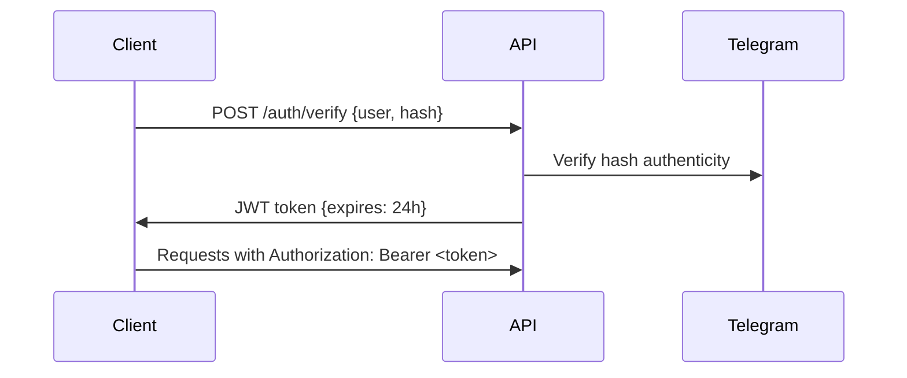

# AI Telegram Moderator Bot

An advanced, multi-tenant Telegram moderation bot built with Node.js that combines AI-powered content analysis with a comprehensive REST API. This bot uses natural language processing to detect and moderate spam or promotional content while providing administrators with powerful tools to manage user strikes fairly and transparently.

**🆕 Features: REST API • AI Content Analysis • Advanced Strike System • Multi-tenant Architecture**

## ✨ Key Features

### 🤖 **AI-Powered Moderation**
- **Smart Content Analysis**: Uses OpenAI's GPT models to analyze messages and detect spam, advertisements, and unwanted content with configurable sensitivity levels
- **Context-Aware Detection**: Considers whitelisted keywords and community context to reduce false positives
- **Configurable AI Sensitivity**: Adjustable spam detection thresholds per group

### ⚖️ **Advanced Strike & Penalty System**
- **Automatic Strikes**: Users receive strikes automatically based on AI content analysis
- **Manual Strike Management**: Admins can add, remove, or set strike counts with detailed reasons and audit trails
- **Flexible Penalty Levels**: Configure different actions (alert, mute, kick, ban) at different strike thresholds
- **Strike Expiration**: Strikes automatically expire after configurable periods
- **Good Behavior Rewards**: Users can earn strike reductions through positive participation
- **Detailed History**: Complete audit trail of all strikes and moderation actions

### 🌐 **REST API Integration**
- **Full REST API**: Complete programmatic access to all bot features
- **JWT Authentication**: Secure token-based authentication integrated with Telegram
- **Group Management**: API endpoints for settings, statistics, and configuration
- **Real-time Updates**: Synchronize bot and API data seamlessly

### 🔐 **Privacy & Security**
- **Private Notifications**: Sensitive information sent via private messages to avoid public shaming
- **Admin-only Commands**: Smart command visibility based on user permissions
- **Secure Authentication**: JWT tokens with configurable expiration
- **Data Protection**: SQLite database with proper user data management

### ⚙️ **Multi-tenant Architecture**
- **Per-Group Configuration**: Independent settings for each Telegram group
- **Scalable Design**: Supports unlimited groups with isolated configurations
- **Admin Verification**: Automatic verification of group administrator permissions
- **Clean Separation**: Bot logic separated from API logic for maintainability

---

## � Quick Start

### Prerequisites
- **Node.js** 22.0.0 or higher
- **npm** (comes with Node.js)
- **Telegram Bot Token** from [@BotFather](https://t.me/BotFather)
- **OpenAI API Key** for AI content analysis

### Installation

1. **Clone the repository:**
   ```bash
   git clone https://github.com/hmcelik/telegram-moderator-bot.git
   cd telegram-moderator-bot
   ```

2. **Install dependencies:**
   ```bash
   npm install
   ```

3. **Configure environment variables:**
   
   Copy the example file and edit it:
   ```bash
   cp .env.example .env
   ```
   
   Edit `.env` with your configuration:
   ```env
   # Required: Telegram Bot Configuration
   TELEGRAM_BOT_TOKEN=your_bot_token_from_botfather
   ADMIN_USER_ID=your_telegram_user_id
   
   # Required: AI/NLP Configuration  
   OPENAI_API_KEY=your_openai_api_key
   
   # Optional: Database Configuration
   DATABASE_PATH=./moderator.db
   
   # Optional: API Server Configuration
   API_PORT=3000
   JWT_SECRET=your-secure-random-string-min-32-chars
   ```

4. **Start the services:**
   ```bash
   # Option 1: Start both bot and API together
   npm start & npm run start:api
   
   # Option 2: Start individual services
   npm start           # Telegram bot only
   npm run start:api   # REST API server only
   
   # Option 3: Development mode with auto-reload
   npm run dev         # Bot with nodemon
   npm run dev:api     # API with nodemon
   ```

5. **Add bot to your Telegram group:**
   - Add your bot to a Telegram group as an administrator
   - Run `/register` command in the group to initialize the bot
   - Use `/settings` in private message to configure moderation settings

### Verification
- **Bot Status**: Check logs for "🚀 Bot is running! Watching for messages..."
- **API Status**: Visit `http://localhost:3000/api/v1/groups` (should return 401 without auth)
- **Database**: Check that `moderator.db` file is created in your project directory

---

## 🤖 Bot Commands & Usage

### For All Users

| Command | Description | Usage |
|---------|-------------|-------|
| `/help` | Show available commands (context-aware) | `/help` |
| `/mystrikes` | Check your strike history (sent privately) | `/mystrikes` |

### For Group Administrators

| Command | Description | Usage Example |
|---------|-------------|---------------|
| `/register` | Initialize bot in new group (required first step) | `/register` |
| `/status` | Display current bot configuration in group | `/status` |
| `/checkstrikes <user>` | View user's strike history (sent privately) | `/checkstrikes @username` |
| `/addstrike <user> <count> [reason]` | Add strikes to user with reason | `/addstrike @user 2 Spam posting` |
| `/removestrike <user> [count] [reason]` | Remove strikes from user | `/removestrike @user 1 Appeal accepted` |
| `/setstrike <user> <count> [reason]` | Set exact strike count for user | `/setstrike @user 0 Fresh start` |
| `/auditlog` | View recent moderation actions (sent privately) | `/auditlog` |

### Configuration Settings

Send `/settings` to the bot in a **private message** to access the configuration menu where you can adjust:

- **Penalty Levels**: Configure at what strike count users get alerted, muted, kicked, or banned
- **AI Sensitivity**: Adjust spam detection threshold (0.1 = very sensitive, 0.9 = very permissive)
- **Timing Settings**: Mute duration, warning message display time, strike expiration
- **Behavior Settings**: Good behavior forgiveness period, keyword whitelist
- **Messages**: Customize warning messages shown to users

### Automatic Moderation

The bot automatically:
1. **Analyzes** all group messages using AI
2. **Scores** content for spam/promotional probability
3. **Takes action** based on configured thresholds and penalty levels
4. **Logs** all actions for transparency and appeals
5. **Manages** strike expiration and good behavior rewards

---

## 🌐 REST API Reference

The bot includes a comprehensive REST API for building web dashboards, mobile apps, or integrating with other systems.

### Quick API Test

1. **Start API server**: `npm run start:api`
2. **Test connectivity**: Visit `http://localhost:3000/api/v1/groups` (expect 401 error = working!)
3. **Generate test JWT**: Use the provided `test-jwt.js` script

### Base Configuration

```
Base URL: http://localhost:3000/api/v1
Authentication: Bearer JWT tokens
Content-Type: application/json
CORS: Enabled for all origins
```

### Authentication Flow



### Available Endpoints

| Method | Endpoint | Description | Auth Required |
|--------|----------|-------------|---------------|
| `POST` | `/auth/verify` | Authenticate with Telegram data | ❌ |
| `GET` | `/groups` | List user's admin groups | ✅ |
| `GET` | `/groups/:groupId/settings` | Get group configuration | ✅ |
| `PUT` | `/groups/:groupId/settings` | Update group settings | ✅ |
| `GET` | `/groups/:groupId/stats` | Get moderation statistics | ✅ |

### API Examples

#### Browser Testing (Developer Console)
```javascript
// Generate JWT token first with test-jwt.js, then:
const token = 'your_jwt_token_here';

// List groups
fetch('http://localhost:3000/api/v1/groups', {
  headers: { 'Authorization': `Bearer ${token}` }
}).then(r => r.json()).then(console.log);

// Get group settings  
fetch('http://localhost:3000/api/v1/groups/-4982630468/settings', {
  headers: { 'Authorization': `Bearer ${token}` }
}).then(r => r.json()).then(console.log);

// Update settings
fetch('http://localhost:3000/api/v1/groups/-4982630468/settings', {
  method: 'PUT',
  headers: { 
    'Authorization': `Bearer ${token}`,
    'Content-Type': 'application/json'
  },
  body: JSON.stringify({
    settings: { muteLevel: 2, kickLevel: 4 }
  })
}).then(r => r.json()).then(console.log);
```

#### cURL Examples
```bash
# List groups
curl -H "Authorization: Bearer YOUR_JWT_TOKEN" \
     http://localhost:3000/api/v1/groups

# Get settings
curl -H "Authorization: Bearer YOUR_JWT_TOKEN" \
     http://localhost:3000/api/v1/groups/-4982630468/settings

# Update settings
curl -X PUT \
     -H "Authorization: Bearer YOUR_JWT_TOKEN" \
     -H "Content-Type: application/json" \
     -d '{"settings":{"muteLevel":1}}' \
     http://localhost:3000/api/v1/groups/-4982630468/settings
```

### Response Examples

**Groups List:**
```json
[{"chatId": "-4982630468", "chatTitle": "My Group"}]
```

**Group Settings:**
```json
{
  "alertLevel": 1, "muteLevel": 2, "kickLevel": 3, "banLevel": 0,
  "spamThreshold": 0.85, "muteDurationMinutes": 60,
  "warningMessage": "⚠️ {user}, please avoid promotional content.",
  "strikeExpirationDays": 30, "goodBehaviorDays": 7
}
```

**Statistics:**
```json
{
  "totalMessagesProcessed": 1547,
  "violationsDetected": 23, 
  "actionsTaken": 15,
  "deletionsToday": 3
}
```

### Error Handling
All errors follow the format:
```json
{
  "status": "error",
  "statusCode": 401,
  "message": "Unauthorized - Missing or invalid JWT token"
}
```

Common status codes: `400` (Bad Request), `401` (Unauthorized), `403` (Forbidden), `404` (Not Found), `500` (Server Error)

---

## 🧪 Development & Testing

### Running Tests
The project includes comprehensive test coverage with Vitest:

```bash
# Run all tests
npm test

# Run tests in watch mode
npm run test:watch

# Run specific test files
npm test __tests__/api/groups.test.js
npm test __tests__/bot/messageHandler.test.js
npm test __tests__/integration/e2e.test.js
```

### Test Coverage
- **Unit Tests**: Individual components and services
- **Integration Tests**: API endpoints with database
- **End-to-End Tests**: Complete bot + API workflows
- **Mock Services**: Telegram API, OpenAI, database operations

### Development Workflow

1. **Start development servers:**
   ```bash
   npm run dev     # Bot with auto-reload
   npm run dev:api # API with auto-reload
   ```

2. **Test changes:**
   ```bash
   npm test        # Run test suite
   ```

3. **API testing:**
   ```bash
   node test-jwt.js  # Generate test JWT token
   # Use token with browser console or cURL
   ```

### Code Structure Guidelines

- **Separation of Concerns**: Bot logic, API logic, and shared services are clearly separated
- **Environment Configuration**: All secrets and config in `.env` file
- **Error Handling**: Comprehensive error handling with proper logging
- **Database Migrations**: Automatic schema creation and updates
- **Security**: JWT authentication, input validation, admin verification

### Contributing

1. Fork the repository
2. Create a feature branch (`git checkout -b feature/amazing-feature`)
3. Make your changes following the existing code style
4. Add tests for new functionality
5. Ensure all tests pass (`npm test`)
6. Commit your changes (`git commit -m 'Add amazing feature'`)
7. Push to your branch (`git push origin feature/amazing-feature`)
8. Open a Pull Request

---

## 📂 Project Structure

The project is structured to separate concerns, making it easy to maintain and extend.

```
src/
├── api/                          # REST API server
│   ├── controllers/             # API request handlers
│   │   ├── authController.js    # Authentication endpoints
│   │   └── groupController.js   # Group management endpoints
│   ├── middleware/              # Express middleware
│   │   ├── checkJwt.js         # JWT authentication
│   │   ├── checkGroupAdmin.js  # Group admin verification
│   │   └── verifyTelegramAuth.js # Telegram auth verification
│   ├── routes/                  # API route definitions
│   │   ├── auth.js             # Authentication routes
│   │   └── groups.js           # Group management routes
│   ├── services/               # API-specific services
│   │   └── tokenService.js     # JWT token management
│   ├── utils/                  # API utilities
│   │   ├── apiError.js         # Custom error class
│   │   └── errorResponder.js   # Error handling middleware
│   └── server.js               # Express server setup
├── bot/                         # Telegram bot
│   ├── handlers/               # Message and command processors
│   │   ├── callbackHandler.js  # Inline keyboard callbacks
│   │   ├── commandHandler.js   # Bot commands
│   │   └── messageHandler.js   # Message analysis & moderation
│   ├── keyboards/              # Inline keyboard layouts
│   │   ├── aiSensitivityMenu.js
│   │   ├── keywordMenu.js
│   │   ├── mainMenu.js
│   │   ├── miscMenu.js
│   │   ├── moderatorMenu.js
│   │   ├── penaltyLevelsMenu.js
│   │   └── whitelistMenu.js
│   └── index.js                # Bot entry point
└── common/                      # Shared services & utilities
    ├── config/                 # Configuration management
    │   └── index.js            # Settings & defaults
    ├── services/               # Core services
    │   ├── database.js         # SQLite database operations
    │   ├── logger.js           # Winston logging
    │   ├── nlp.js             # OpenAI/NLP integration
    │   └── telegram.js         # Telegram Bot API wrapper
    └── utils/
        └── enums.js            # Shared enumerations

__tests__/                       # Test suites
├── api/                        # API endpoint tests
├── bot/                        # Bot handler tests
├── integration/                # End-to-end tests
└── database.test.js            # Database tests

.env                            # Environment variables
package.json                    # Project metadata & scripts
vitest.config.js               # Test configuration
```

-----

## 📦 Dependencies

### Core Dependencies
- **axios**: For making HTTP requests to external APIs (OpenAI, Telegram).
- **cors**: Cross-Origin Resource Sharing middleware for the API server.
- **dotenv**: To load environment variables from the `.env` file.
- **express**: Fast, unopinionated web framework for the REST API.
- **express-validator**: Input validation and sanitization for API endpoints.
- **jsonwebtoken**: JWT token generation and verification for API authentication.
- **node-telegram-bot-api**: The core library for interacting with the Telegram Bot API.
- **sqlite** & **sqlite3**: Promise-based wrapper and driver for the SQLite database.
- **winston**: Versatile logging library for both bot and API operations.

### Development Dependencies
- **nodemon**: Development server with auto-reload for both bot and API.
- **supertest**: HTTP testing library for API endpoint testing.
- **vitest**: Modern and fast test runner for unit and integration testing.

---

## � License

This project is licensed under the **MIT License** - see the [LICENSE](LICENSE) file for details.

## 🤝 Support

- **Issues**: Report bugs or request features on [GitHub Issues](https://github.com/hmcelik/telegram-moderator-bot/issues)
- **Discussions**: Join community discussions on [GitHub Discussions](https://github.com/hmcelik/telegram-moderator-bot/discussions)
- **Documentation**: Comprehensive guides available in the `/docs` directory

## ⭐ Star the Project

If you find this project helpful, please consider giving it a star on GitHub! It helps others discover the project and motivates continued development.

---

*Built with ❤️ for the Telegram community*